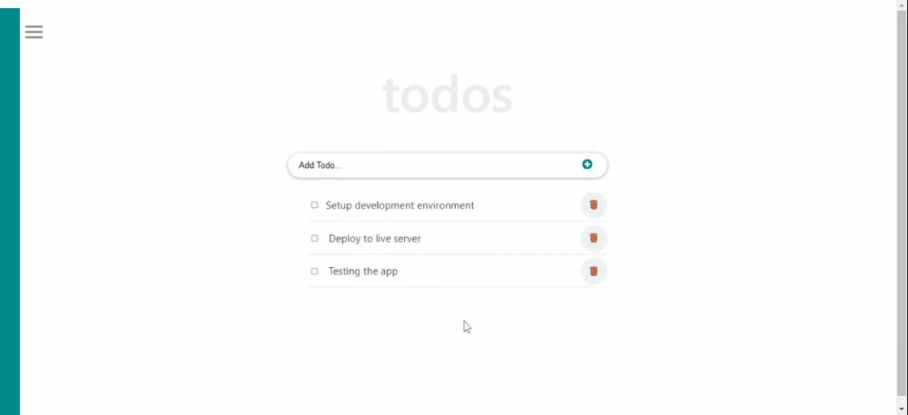

    
   

  <h3><b>Todo App Using React </b></h3>

<!-- TABLE OF CONTENTS -->

# 📗 Table of Contents

- [📖 About the Project](#about-project)
  - [🛠 Built With](#built-with)
    - [Tech Stack](#tech-stack)
    - [Key Features](#key-features)
  - [🚀 Live Demo](#live-demo)
- [💻 Getting Started](#getting-started)
  - [Setup](#setup)
  - [Prerequisites](#prerequisites)
  - [Install](#install)
  - [Usage](#usage)
  - [Run tests](#run-tests)
  - [Deployment](#triangular_flag_on_post-deployment)
- [👥 Authors](#authors)
- [🔭 Future Features](#future-features)
- [🤝 Contributing](#contributing)
- [⭐️ Show your support](#support)
- [🙏 Acknowledgements](#acknowledgements)
- [❓ FAQ](#faq)
- [📝 License](#license)

<!-- PROJECT DESCRIPTION -->

# 📖 [React Todo App] 

> **Todos App** is a web-based application that allow user to manage thier todo lists. It is a Single Page App (SPA) that allows users to **-Add, Edit, Check/Uncheck, Remove_** todo lists. I built the app to consolidate my knowledge about React, components, props, state, and hooks etc. Any one can take this project as a refernce to learn basics of ReactJS. 

## 🛠 Built With 

### Tech Stack 

> - VS Editor
> - GitHub and Gitflow
> - JavaScript ES6
> - React.js

<!-- Features -->

### Key Features 

> The key features of this web app include.

> **Interactive**
> - Add, Edit, Check/Uncheck, Remove todo items
> - Responsive web app 
> - Single Page App
> - From and React components validation

(<a href="#readme-top">back to top</a>)

<!-- LIVE DEMO -->

## 🚀 Live Demo 

- [Live Demo Link](https://microverse-fullstack-program.github.io/React-Todos-App/)

(<a href="#readme-top">back to top</a>)

<!-- GETTING STARTED -->

## 💻 Getting Started 

> To get a local copy up and running, follow these steps.

### Prerequisites

In order to run this project you need to install npm and node.js as well as webpack and linter modules
> - NodeJS
> - NPM
> - React and React-Dom

### Setup

Clone this repository to your desired folder: Here is simple setp you can follow
0. Install git and VScode if not already installed
1. Open terminal in VScode
2. Navigate to the directory where you want clone the copy of this repository
3. Create new directory [optional]
4. Clone the repo using the below command - just copy and paste in the terminal
 > git clone https://github.com/Microverse-Fullstack-Program/react-todo-app.git
5. Alternatively, you can download the zip file of your project by clicking on the **_Code_** button on Github project page page and clicking on Download ZIP

## Install and Run

In the project directory, you can run:

### `npm install`

> Run this commmand to install all the required depedency for the project.

### `npm start`

Runs the app in the development mode.\
Open [http://localhost:3000](http://localhost:3000) to view it in your browser.

The page will reload when you make changes.\
You may also see any lint errors in the console.

### `npm run build`

Builds the app for production to the `build` folder.\
It correctly bundles React in production mode and optimizes the build for the best performance.

The build is minified and the filenames include the hashes.\
Your app is ready to be deployed!

See the section about [deployment](https://facebook.github.io/create-react-app/docs/deployment) for more information.

 ### Usage

This project can be used to learn and practice basics of React.js. Specifically;
* React components.
* React props and state
* React Events.
* Refactor with hooks.
* Components lifecycle
* React Routing
* React SPA deployment with GH-pages

> #### Getting Started with Create React App
> - This project was bootstrapped with [Create React App](https://github.com/facebook/create-react-app).

(<a href="#readme-top">back to top</a>)

<!-- AUTHORS -->

## 👥 Authors 

> The collaborators of this project.

👤 **Chere Lemma**

- GitHub: [@githubhandle](https://github.com/cherelemma)
- Twitter: [@twitterhandle](https://twitter.com/Chere21271613)
- LinkedIn: [LinkedIn](https://www.linkedin.com/in/chere-lemma27211613)

(<a href="#readme-top">back to top</a>)

## 🤝 Contributing 

Contributions, issues, and feature requests are welcome!

Feel free to check the [issues page](https://github.com/Microverse-Fullstack-Program/react-todo-app/issues).

(<a href="#readme-top">back to top</a>)

## ⭐️ Show your support 

Give a ⭐️ if you like this project!

(<a href="#readme-top">back to top</a>)

## 🙏 Acknowledgments 

> I would like to thank [Microverseinc](https://github.com/microverseinc) for.

* [Readme-template](https://github.com/microverseinc/readme-template)
* [Linter for React & Redux](https://github.com/microverseinc/linters-config)
* [React Tutorial From Scratch: A Step-by-Step Guide (2021)](https://ibaslogic.com/react-tutorial-for-beginners/)

(<a href="#readme-top">back to top</a>)

## 📝 License 

This project is [MIT](./LICENSE) licensed.

(<a href="#readme-top">back to top</a>)

